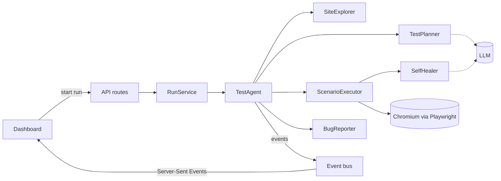

# TestPilot

TestPilot tests websites the way a QA analyst would. Give it a URL and a user story. It opens a real browser, works out what to test, clicks through the flows and tells you what broke, with screenshots and the steps to reproduce it.

We're building it for the [Sebaka Testing AI Hackathon 2026](https://sebakasouthafrica.co.za/ai-agent-challenge.html), functional testing track.

<!-- SonarQube Cloud badges go here after the first scan: quality gate, coverage, security rating -->

## The problem

Small teams ship often and test by hand. Before a release, someone clicks through sign-up and checkout. On a busy week nobody does, and customers find the bug first.

Teams that do automate find their tests breaking every time a button is renamed or a page is rearranged. Fixing selectors becomes a chore, and the suite gets switched off.

## What TestPilot does

| Stage | What happens |
|---|---|
| **Receives** | A URL, and optionally a user story with acceptance criteria. |
| **Decides** | Reads each page's accessibility tree, then plans happy-path, negative and edge-case scenarios. |
| **Executes** | Runs every step in headless Chromium with Playwright and takes a screenshot after each one. When a button has been renamed, it finds it again and marks the step as healed so a person can check it. |
| **Delivers** | A live dashboard, bug reports with expected and actual results, JUnit XML for CI, and a Playwright test file your team can keep. |

## The AI proposes, Playwright decides

The language model plans the tests and suggests how to find elements. It never decides whether a test passed. Every pass or fail comes from a real assertion in a real browser, every screenshot is a real capture, and every timing is measured.

If TestPilot shows you a result, it happened.

## Try it

You need Node 22 or newer and an API key for Gemini, Claude or OpenAI. A run makes only a handful of model calls, so Gemini's free tier is enough to try it.

```bash
git clone https://github.com/PhathutshedzoPR/AI-Agent-Functional-testing.git testpilot
cd testpilot
npm install
npx playwright install chromium
cp .env.example .env.local
```

Put your provider, model and key in `.env.local`, then:

```bash
npm run dev
```

Open http://localhost:3000, click **Run a test**, pick Kota Express and one of the suggested stories.

No key? Set `LLM_PROVIDER=replay` in `.env.local`. TestPilot then uses plans we recorded earlier for the suggested stories. The browser still runs for real.

## Kota Express

Testing a tester needs a site where you already know the right answers. Kota Express is a small kota ordering site that ships inside this repo at `/demo-shop`, in three releases:

- **stable** works.
- **redesign** behaves the same, but the buttons are renamed and the layout has moved. Hand-written test scripts break here. TestPilot heals and flags what changed.
- **buggy** has four seeded bugs, including a cart total that ignores quantity and a cellphone field that accepts letters.

<!-- Scorecard: paste the real table printed by tests/integration/scorecard.test.ts here -->

## How it's built



- **Next.js 16** and TypeScript for the dashboard, the API and the demo shop.
- **Playwright** drives Chromium. The agent finds elements the way a person would describe them (role and name, label, visible text), so the tests it exports read like good hand-written ones.
- **Vercel AI SDK** talks to Gemini, Claude or OpenAI. Every response is checked against a Zod schema before we use it.
- **SonarQube Cloud**, ESLint with the SonarJS rules, and Vitest run on every push.

The code is split so the agent doesn't know it lives in a web app:

| Folder | What's in it |
|---|---|
| `src/core` | The agent, the domain model and the interfaces it needs. Plain TypeScript with no framework imports. |
| `src/adapters` | Playwright, the LLM providers, storage, exporters and the URL guard, each behind an interface from `src/core/ports`. |
| `src/server` | Wiring, environment validation, rate limiting and HTTP helpers. |
| `src/app`, `src/components` | The dashboard, the API routes and Kota Express. |
| `tests` | Unit tests with fakes, and integration tests against Kota Express in a real browser. |

Because the core only depends on interfaces, the same agent also runs from the command line (`npm run agent`), which is how it would sit in a CI pipeline.

Patterns we used on purpose: Strategy for actions, healing and exporters; Template Method for the agent's pipeline; Observer for live events; Decorator for recording LLM responses; Repository for runs; constructor injection from a single composition root.

## Security

An agent that opens whatever URL you give it, on a server, needs guard rails:

- API keys stay on the server and are validated before use. Nothing secret reaches the browser.
- By default the agent only visits hosts on an allowlist. In public mode it refuses private, loopback and cloud metadata addresses, and checks every request the browser makes, including redirects.
- Web pages are untrusted input. The model's output has to match a schema and an allowlist of actions, and nothing it returns is run as code.
- Every API input is validated. Runs are rate-limited, time-boxed and capped in steps and LLM calls, and the browser is always closed afterwards.
- Known gap: in public mode, DNS rebinding could slip between our address check and the browser's own lookup. Allowlist mode doesn't have this problem.

## Scripts

| Command | What it does |
|---|---|
| `npm run dev` | Development server on port 3000 |
| `npm run build`, then `npm start` | Production build and server |
| `npm run check` | Lint, typecheck and unit tests |
| `npm run test:coverage` | Unit tests with coverage for SonarQube Cloud |
| `npm run test:integration` | The agent against Kota Express in real Chromium |
| `npm run agent -- --url <url> --story "<text>"` | Run the agent from a terminal; JUnit and Markdown go to `./reports` |

## Limitations

- It needs a long-running Node server: a laptop, a VM or Docker. Serverless functions can't launch Chromium the way we use it.
- One run at a time. Others wait in a queue.
- It can't get past CAPTCHAs or two-factor logins.
- Healing can hide a real change. That's why healed steps are listed for review instead of counted as clean passes.

## History

The first prototype (tag `v0-prototype`) was a single-file dashboard that sketched the product with simulated results. This version runs every test in a real browser.

<!-- Team: add names and roles before submitting -->

## Licence

MIT
