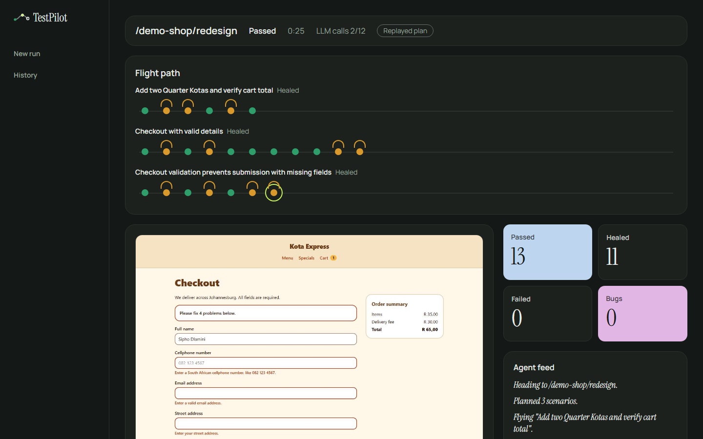
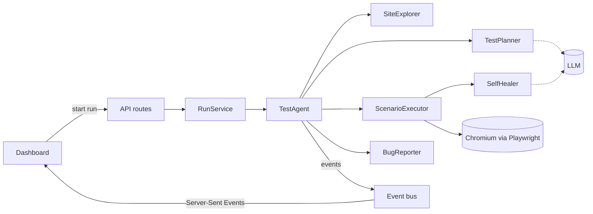

# TestPilot

TestPilot tests websites the way a QA analyst would. Give it a URL and a user story. It opens a real browser, works out what to test, clicks through the flows and tells you what broke, with screenshots and the steps to reproduce it.

We're building it for the [Sebaka Testing AI Hackathon 2026](https://sebakasouthafrica.co.za/ai-agent-challenge.html), functional testing track.

[](https://github.com/PhathutshedzoPR/AI-Agent-Functional-testing/actions/workflows/ci.yml)
[](https://sonarcloud.io/summary/new_code?id=PhathutshedzoPR_AI-Agent-Functional-testing)
[](https://sonarcloud.io/component_measures?id=PhathutshedzoPR_AI-Agent-Functional-testing&metric=coverage)
[](https://sonarcloud.io/component_measures?id=PhathutshedzoPR_AI-Agent-Functional-testing&metric=security_rating)

## The problem

Small teams ship often and test by hand. Before a release, someone clicks through sign-up and checkout. On a busy week nobody does, and customers find the bug first.

Teams that do automate find their tests breaking every time a button is renamed or a page is rearranged. Fixing selectors becomes a chore, and the suite gets switched off.

## What TestPilot does

| Stage | What happens |
|---|---|
| **Receives** | A URL, and optionally a user story with acceptance criteria. |
| **Decides** | Reads each page's accessibility tree, then plans happy-path, negative and edge-case scenarios. |
| **Executes** | Runs every step in headless Chromium with Playwright and takes a screenshot after each one. When a button has been renamed, it finds it again and marks the step as healed so a person can check it. |
| **Delivers** | A live dashboard, bug reports with expected and actual results, JUnit XML for CI, and a Playwright test file your team can keep. |

## The AI proposes, Playwright decides

The language model plans the tests and suggests how to find elements. It never decides whether a test passed. Every pass or fail comes from a real assertion in a real browser, every screenshot is a real capture, and every timing is measured.

If TestPilot shows you a result, it happened.

## Try it

You need Node 22 or newer and an API key for Gemini, Claude or OpenAI. A run makes only a handful of model calls, so Gemini's free tier is enough to try it.

```bash
git clone https://github.com/PhathutshedzoPR/AI-Agent-Functional-testing.git testpilot
cd testpilot
npm install
npx playwright install chromium
cp .env.example .env.local
```

Put your provider, model and key in `.env.local` (we use `LLM_PROVIDER=google` with `LLM_MODEL=gemini-3.5-flash`), then:

```bash
npm run dev
```

Open http://localhost:3000 (use `localhost`, not `127.0.0.1`: writes must come from `APP_BASE_URL`), click **Run a test**, pick Kota Express and a suggested story, and click **Start run**.

For the demo, use a production build: `npm run build` then `npm start`.

No key? Set `LLM_PROVIDER=replay`. TestPilot then serves plans recorded in `fixtures/llm-replays` and the browser still runs every step for real. A replay only matches the exact story text and page content it was recorded with; record more by running with `LLM_RECORD=true` and a live provider.

### The demo in three runs

1. **Stable:** pick Kota Express (stable) and "Order two kotas and check out". Every step passes.
2. **Redesign:** when the stable run finishes, click **Run this plan on Redesign**. The same plan meets renamed buttons; the flight path shows each healed step as a detour, and **Needs review** lists what changed.
3. **Buggy:** start a fresh run on Kota Express (buggy) with the same story. TestPilot reports the cart-total bug with steps to reproduce, expected against actual, and the screenshot, and flags the Specials link that returns 404. Download the JUnit XML or the Playwright test from **Export**.

## Kota Express

Testing a tester needs a site where you already know the right answers. Kota Express is a small kota ordering site that ships inside this repo at `/demo-shop`, in three releases:

- **stable** works.
- **redesign** behaves the same, but the buttons are renamed and the layout has moved. Hand-written test scripts break here. TestPilot heals and flags what changed.
- **buggy** has four seeded bugs, including a cart total that ignores quantity and a cellphone field that accepts letters.

### What happened when we ran it

We planned these runs live with `gemini-3.5-flash` on 6 October 2026 and recorded every model response in `fixtures/llm-replays`. The numbers below are from replaying those recordings (`LLM_PROVIDER=replay`) with the current code; the browser ran every step for real. Story: "order two Quarter Kotas and check out".

| Release | Result | Steps | LLM calls | Time |
|---|---|---|---|---|
| stable | Passed | 24 of 24 passed | 1 (plan) | 17 s |
| buggy | Bugs found: cart total ignores quantity; Specials link returns 404 | 14 passed, 1 failed | 2 (plan, wording) | 20 s |
| redesign (stable's plan, re-run) | Passed after healing | 13 passed, 11 healed (in Needs review), 0 failed | 2 (heals) | 25 s |

On redesign, rules repaired the renamed "Add to bag" buttons; the LLM proposed "Proceed to payment" and "Confirm order", and each suggestion was checked in the browser before use. A rename found once is reused for the rest of the run, so later checks such as "the Confirm order button is gone" test the renamed control, not a button that no longer exists.



The automated proof lives in `tests/integration`: a hand-written plan and a scripted-plan agent run against the real app in real Chromium (stable passes, buggy fails at the cart total, redesign passes by healing), and an exported Playwright spec that passes with `npx playwright test`.

## How it's built



- **Next.js 16** and TypeScript for the dashboard, the API and the demo shop.
- **Playwright** drives Chromium. The agent finds elements the way a person would describe them (role and name, label, visible text), so the tests it exports read like good hand-written ones.
- **Vercel AI SDK** talks to Gemini, Claude or OpenAI. Every response is checked against a Zod schema before we use it.
- **SonarQube Cloud**, ESLint with the SonarJS rules, and Vitest run on every push.

The code is split so the agent doesn't know it lives in a web app:

| Folder | What's in it |
|---|---|
| `src/core` | The agent, the domain model and the interfaces it needs. Plain TypeScript with no framework imports. |
| `src/adapters` | Playwright, the LLM providers, storage, exporters and the URL guard, each behind an interface from `src/core/ports`. |
| `src/server` | Wiring, environment validation, rate limiting and HTTP helpers. |
| `src/app`, `src/components` | The dashboard, the API routes and Kota Express. |
| `tests` | Unit tests with fakes, and integration tests against Kota Express in a real browser. |

Because the core only depends on interfaces, the same agent also runs from the command line (`npm run agent`), which is how it would sit in a CI pipeline.

Patterns we used on purpose: Strategy for actions, healing and exporters; Template Method for the agent's pipeline; Observer for live events; Decorator for recording LLM responses; Repository for runs; constructor injection from a single composition root.

## Security

An agent that opens whatever URL you give it, on a server, needs guard rails:

- API keys stay on the server and are validated before use. Nothing secret reaches the browser.
- By default the agent only visits hosts on an allowlist. In public mode it refuses private, loopback and cloud metadata addresses, and checks every request the browser makes, including redirects.
- Web pages are untrusted input. The model's output has to match a schema and an allowlist of actions, and nothing it returns is run as code.
- Every API input is validated. Runs are rate-limited, time-boxed and capped in steps and LLM calls, and the browser is always closed afterwards.
- Known gap: in public mode, DNS rebinding could slip between our address check and the browser's own lookup. Allowlist mode doesn't have this problem.

## Scripts

| Command | What it does |
|---|---|
| `npm run dev` | Development server on port 3000 |
| `npm run build`, then `npm start` | Production build and server (use this for the demo) |
| `npm run check` | Lint, typecheck and unit tests (308 tests) |
| `npm run test:coverage` | Unit tests with coverage for SonarQube Cloud |
| `npm run test:integration` | Builds the app, starts it on a spare port and runs the agent against Kota Express in real Chromium |
| `npm run format` | Prettier |

Planned, not built yet: a command-line runner (`npm run agent`) for CI pipelines.

## Limitations

- It needs a long-running Node server: a laptop, a VM or Docker. Serverless functions can't launch Chromium the way we use it.
- One run at a time. Others wait in a queue.
- It can't get past CAPTCHAs or two-factor logins.
- Healing can hide a real change. That's why healed steps are listed for review instead of counted as clean passes.
- Run history is kept in memory and is lost when the server restarts. Screenshots stay in `.data/artifacts`.
- The planner cannot see pages that only appear after an action (such as the order confirmation), so it checks those outcomes indirectly, for example that the submit button is gone.
- In development, Next.js sometimes reports a hydration warning on the shop's checkout page inside the agent's browser; it shows up as a console-error finding. Production builds don't report it.

## History

The first prototype (tag `v0-prototype`) was a single-file dashboard that sketched the product with simulated results. This version runs every test in a real browser.

## Team

Built for the Sebaka Testing AI Hackathon 2026, functional testing track.

| Name | Role |
|---|---|
| Tokollo | Software development |
| Phathutshedzo | Project management |
| Gundo | Business analysis |

## Licence

MIT
